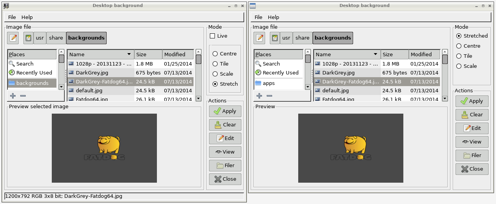
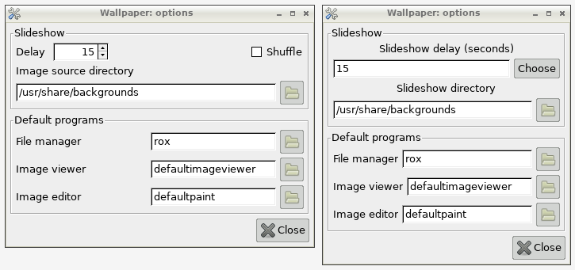
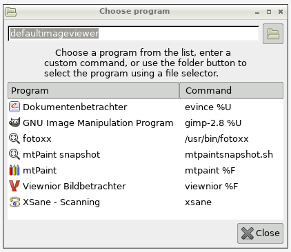

# nathans-wallpaper

This repository includes a bug fix and new functionality fork of Nathan's Wallpaper Setter for Fatdog64 linux (and Puppy linux flavors).

## Motivation

In 2006 Puppy linux forum user Nathan developed a shell-based wallpaper setter for Grafpup and stopped development at version 0.5.6 [>forum thread](http://www.murga-linux.com/puppy/viewtopic.php?t=69658). The app was hacked by various forum users and became version 0.6, which is still distributed with Fatdog64-700, a 64-bit OS in the Puppy linux family.

When I noticed that the Fatdog64 wallpaper setter had distorted my wallpaper, I started researching about this problem and found an [old post](http://bkhome.org/blog/?viewDetailed=02377) on Barry Kauler's blog that hinted at a possible solution. This solution was implemented in `pwallpaper` setter for Quirky, another OS of the Puppy family, but had never been integrated into Nathan's wallpaper setter. So I set out to integrate it for Fatdog64. And while doing that I fixed several other bugs (or creeping incompatibilities) and added considerable new functionality.

## Overview

Wallpaper setter 0.7.0 enhances usability and functionality:

 * New live preview mode - The desktop wallpaper is updated immediately as the
   file list selection changes. Changes are temporary and automatically
   revert on exit, or they can be made permanent.
 * Full BMP, GIF and TIFF support across all program functions.
 * Preview icons for folder and no-image objects.
 * New application status bar displays image meta data.
 * Tooltips added to mode and action buttons and to preferences dialog.
 * Undistorted wallpaper stretching (constant aspect ratio).
 * Slideshow: add playlist support, shuffle list, new image types,
   lower resource usage.
 * Redesigned preferences dialog with program chooser.
 * Bug and incompatibility fixes.
 * Test on Fatdog64 701, gtkdialog 0.8.4.
 * See full set of changes in [Changelog](Changelog.md) file.

## Starting, command line, slideshow

Normally you should start the Wallpaper setter GUI from Fatdog64's Control
Panel, but a command line is also available:

    /usr/bin/wallpaper [ARG]            # where ARG can be:
    "/path/to/wallpaper.jpg"            # set background (JPEG, PNG, etc.)
    -about                              # display version dialog and exit
    -clear                              # clear desktop background
    -h|-help                            # output help text and exit
    -play[=MODE]                        # play images under slideshow directory
    -play-list=PLAYLIST-FILE            # play image paths in PLAYLIST-FILE
    -prefs                              # display application preferences dialog
    path1.ext path2.ext [path.ext...]   # play path*.ext
    -stop                               # stop slideshow

Note that 'Live mode' is only available when no ARG is specified. In this case you can play a slideshow by selecting "Play" from the application menu.

The slideshow directory can be set with `-prefs` or in the Preferences dialog (application menu).

Each slide plays using the current wallpaper MODE: Centre, Tile, Scale, Stretch.
Wallpaper MODE can be set with `-prefs` or the Preferences dialog or by writing its value in file `$HOME/.config/wallpaper/backgroundmode`.  Bypass using the saved mode with `-play=MODE` or by prefixing the MODE and a colon to the image path argument, i.e.,

    /usr/bin/wallpaper Stretch:/path/to/wallpaper.jpg

A PLAYLIST-FILE simply lists the set of image filepaths, one per line,
formatted as `[MODE':']/path/to/image.ext` like in the previous example.

Set slideshow delay and shuffle mode in the Preferences dialog or by editing `$HOME/.config/wallpaper/preferences`.

### Environment Variables

The following environment variables affect the application: `SCALE_FILTER`,
`DEBUG`. Run `wallpaper --help` for more information.

## Warnings

### Stop the slideshow

I found this warning in Nathan's [original thread](http://www.murga-linux.com/puppy/viewtopic.php?t=29657) for version 0.5:

_CAUTION! You must manually stop the slideshow before shutting down X or your ROX pinboard file will become corrupted. This is automatically taken care of in Grafpup but will have to be sorted out in Puppy if this is to be adopted._

I do not know if this warning still applies to version 0.6.3 on which my version 0.7.0 is based. You have been warned; be careful to stop a running
slideshow before shutting down X. The command line is: `wallpaper -stop`.

### Pass valid image files to the slideshow

If you play the slideshow with

    wallpaper -play-list=playlist-file
 
you may inadvertently include a non-image file or a corrupted image file inside `playlist-file`. Similarly, you could type something like

    wallpaper my-precious-data.xls

by mistake, that is passing a data file when you mean to pass an image file.

_CAUTION! If ROX-Filer is requested to set the pinboard equals to your data file or corrupted image file, there is a chance that ROX-Filer will mark your file as an "invalid pinboard" and **delete** your file._

I plugged all code paths that I could spot against this possibility, so
the chance that your file be deleted is indeed very slim. But to be certain
you can only make sure never to pass a data file or a corrupted image file
to the above command lines. (This incident occurred to me only once, when I passed a corrupted BMP file. That code path has been plugged.)

## Compatibility

I tried to implement my code in a way that is compatible with Quirky's `pwallpaper` setter, and possibly with other recent Puppies that are still using, or want to use, Nathan's wallpaper setter. However, I make no promise about compatibility, as I develop and test on Fatdog64, and I have no time to test and fix other Puppies. For those I will be glad to merge pull-requests from other contributors.

One more thing to say about compatibility concerns Fatdog64 only. As mentioned, Fatdog has (Nathan's) wallpaper setter 0.6.3, which can run a slideshow. It also has another slideshow script, `/usr/bin/wallpaper-slideshow`. I have not even checked whether my fork of wallpaper setter 0.6.3 should be compatible with `wallpaper-slideshow`.

## Bugs

Please file bugs in the Issues section of the github [repository](https://github.com/step-/nathans-wallpaper/issues).

## Screenshots

Left: Forked version - Right: original version 0.6.3 (Fatdog64-700).

**Main window**

**Options dialog**

**Program chooser**

(not available in version 0.6.3)

